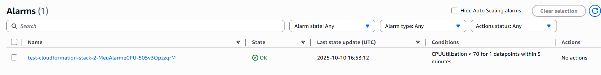

#  CloudWatch Alarm com AWS CloudFormation

Este projeto cria um **alarme do Amazon CloudWatch** para monitorar o uso de CPU de uma instância EC2, utilizando um template simples em **AWS CloudFormation**.
Quando a CPU da instância ultrapassar 70% por mais de 5 minutos, o alarme será ativado.

## O que é o Amazon CloudFormation?

O Amazon CloudFormation é um serviço da AWS, de infrastructure as code(IaC), que facilita a modelagem e configuração de recursos da AWS. Com ele, é possível criar automatizações dentro da AWS. Por meio de uma stack, é possível definir uma infraestrutura da automação. isso pode ser feita usando arquivos no formato YAML ou JSON.

Para mais informações sobre stack no Cloud Formation, no projeto [Implementenando Stack no Cloud Formation](https://github.com/amandou/DIO-Courses/tree/main/Santander%20Code%20Girls%20-%202025/Implementando%20Stack%20no%20Cloud%20Formation).

## Principais Características
- Infraestrutura como Código (IaC): define sua infraestrutura de forma declarativa.
- Automatização: provisiona e atualiza recursos automaticamente.
- Versão Controlada: facilita rastrear mudanças usando sistemas como Git.
- Gerenciamento completo do ciclo de vida: desde a criação até a exclusão de recursos.
- Suporte a dependências: entende a ordem correta para criar ou remover recursos.

## Benefícios
- Padronização: aplica as mesmas configurações em diferentes ambientes (dev, staging, prod).
- Reprodutibilidade: reproduz ambientes facilmente em diferentes contas/regiões.
- Redução de Erros Humanos: elimina etapas manuais.
- Auditoria e Controle: torna as alterações transparentes e rastreáveis.
- Escalabilidade: facilita o gerenciamento de infraestruturas complexas com centenas de recursos.

# Projeto

Antes de implantar este template, você precisa:
- Ter uma instância EC2 em execução.
- Ter permissões para criar recursos via AWS CloudFormation e CloudWatch.

1. Clone o repositório
2. Mude o valor de Value para o id de sua instancia EC2
3. Crie uma stack usando o arquivo config.yaml como template
4. Escolha um nome para sua stack, e prossiga com a criação.
5. Acesse o serviço CloudWatch > Alarmes. E irá aparecer assim: 

    

