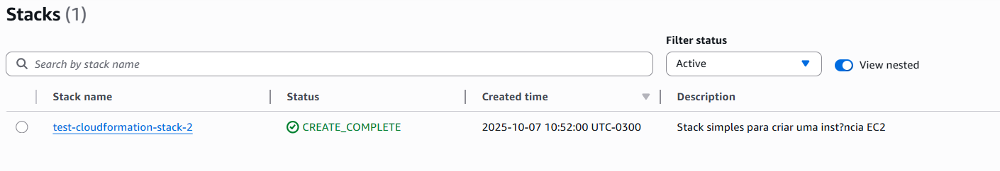
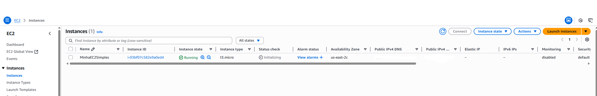

# Introdução ao AWS CloudFormation e Criação de uma Stack Simples

Este projeto tem como objetivo demonstrar a criação de uma stack simples, utilizando o AWS CloudFormation, provisionando uma instância EC2 com apenas alguns recursos básicos. 

## O que é o Amazon CloudFormation?

O Amazon CloudFormation é um serviço da AWS, de infrastructure as code(IaC), que permite modelar, provisionar e gerenciar recursos de nuvem de forma automática e segura. É possível definir toda a sua infraestrutura usando arquivos de texto no formato YAML ou JSON.

## Principais Características
- Infraestrutura como Código (IaC): define sua infraestrutura de forma declarativa.
- Automatização: provisiona e atualiza recursos automaticamente.
- Versão Controlada: facilita rastrear mudanças usando sistemas como Git.
- Gerenciamento completo do ciclo de vida: desde a criação até a exclusão de recursos.
- Suporte a dependências: entende a ordem correta para criar ou remover recursos.

## Benefícios
- Padronização: aplica as mesmas configurações em diferentes ambientes (dev, staging, prod).
- Reprodutibilidade: reproduz ambientes facilmente em diferentes contas/regiões.
- Redução de Erros Humanos: elimina etapas manuais.
- Auditoria e Controle: torna as alterações transparentes e rastreáveis.
- Escalabilidade: facilita o gerenciamento de infraestruturas complexas com centenas de recursos.

## Stack no AWS Cloud Formation

Uma Stack é uma coleção de recursos AWS que você pode gerenciar como uma única unidade. Com isso, é possível atualizar ou excluir um conjunto inteiro de recursos ao executar ações na stack. Por exemmplo, ao criar uma stack chamada MinhaAplicacaoWeb, que contém uma instância EC2, um Security Group e um Volume EBS. Ao excluir essa stack, todos os recursos relacionados também serão excluídos automaticamente.


# Criando uma Stack Simples com uma Instância EC2

1. Antes de tudo, é preciso ter: a AWS CLI configurada ou acesso ao Console da AWS, Chave SSH existente (para a EC2) e as permissões para usar EC2 e CloudFormation.

2. Crie um arquivo chamado ec2-simple-stack.yaml com o seguinte conteúdo:

```
AWSTemplateFormatVersion: '2010-09-09'
Description: Stack simples para criar uma instância EC2

Resources:
  MinhaInstanciaEC2:
    Type: AWS::EC2::Instance
    Properties:
      InstanceType: t3.micro
      ImageId: ami-******  # Varia de acordo com a região, substituir por um valor válido
      Tags:
        - Key: Name
          Value: MinhaEC2Simples

```

3. Criando a Stack via Console
- Acesse o AWS CloudFormation Console
- Clique em "Criar pilha" > Com novos recursos (padrão).
- Faça upload do arquivo ec2-simple-stack.yaml.
- Dê um nome para a stack, como StackEC2Simples.
- Deixe as opções como estão, clique em Avançar e depois Criar Pilha.

Se tudo der certo sua stack estará desse jeito:

<p align="center">
    
</p>

4. Após alguns minutos, a instância EC2 será criada. Você pode acessá-la pelo console EC2 e verificar se está em execução.

<p align="center">
    
</p>

5. Exclua a Stack e a instância EC2 criada.
- Quando não precisar mais da infraestrutura, exclua a stack e todos os recursos associados para evitar custos.

