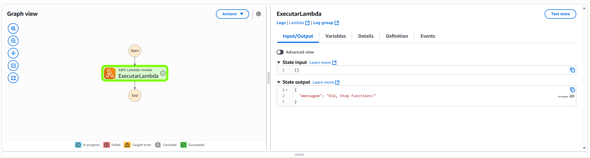

# Amazon Step Functions

O AWS Step Functions é um serviço da AWS que permite orquestrar múltiplos serviços da AWS em fluxos de trabalho serverless. Ele facilita a coordenação de aplicações distribuídas, micro serviços, automatização de processos e crição de pipeline de daods e machine learning. 

## Principais Características

- Modelagem Visual: Interface gráfica para visualizar, executar e depurar o fluxo de trabalho.
- Controle de Fluxo: Suporte a condições, paralelismo, tratamento de exceções.
- Orquestração Serverless: Coordena chamadas de Lambda, ECS, DynamoDB, SQS, SNS, entre outros serviços AWS, sem necessidade de infraestrutura adicional.
- Resiliência e Monitoramento: Retentativas automáticas, controle de estado e integração com CloudWatch para observabilidade.
- Integração com SDK: Suporte nativo para chamadas de APIs via AWS SDK sem necessidade de criar Lambdas intermediários.

## Benefícios

- Integração rápida e intuitiva
- Automação simples
- Processamento de dados sob demanda
- Visualização de arquitetura orientada por eventos

# Usando AWS Step Functions com Lambda

Vamos criar um "Hello World" usando AWS Step Functions com lambda

1. Criar a função Lambda
Crie uma função lambda com o nome "HelloStepFunctions"

```
def lambda_handler(event, context):
    return {
        "mensagem": "Olá, Step Functions!"
    }
````

2. Criação da Step Function

Nessa etapa, vamos fazer a descrição dos nos via JSON.

- Para a versão de JSON

```
{
  "StartAt": "ExecutarLambda",
  "States": {
    "ExecutarLambda": {
      "Type": "Task",
      "Resource": "arn:aws:lambda:REGIAO:ID:function:HelloStepFunctions",
      "End": true
    }
  }
}
````

Substitua REGIAO e ID pela sua região AWS e ID da conta.

3. Execução

- Vá até o AWS Step Functions no console.
- Clique em Executar nova execução.
- Pode deixar o input vazio ({}).

Se tudo der certo, aparecerá assim no StepFunctions:

<p align="center">
    
</p>

### Observação
O nome da função lambda deve ser o mesmo que está ao final da linha de resource do código do json, se não dará erro.